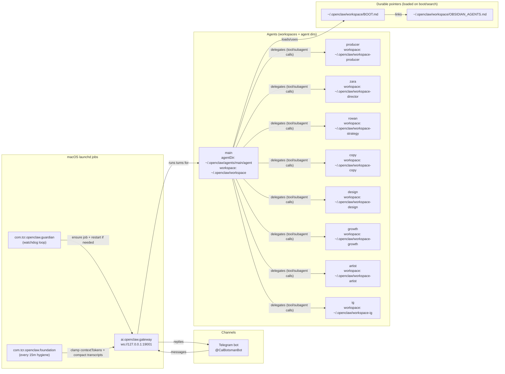

# Agents Map

This is a quick, visual reference for how Cal's OpenClaw agents are wired (gateway, watchdogs, channels, and agent workspaces).

## Quick Commands

- Open the control UI: `openclaw dashboard`
- List agents: `openclaw agents list`
- Check Telegram health: `openclaw health`

